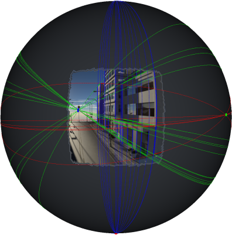
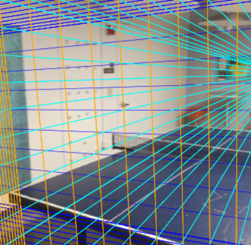
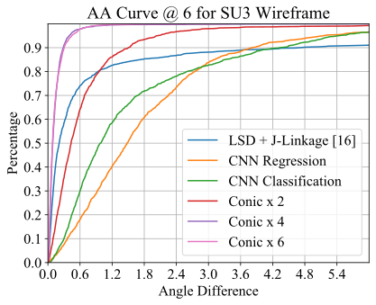
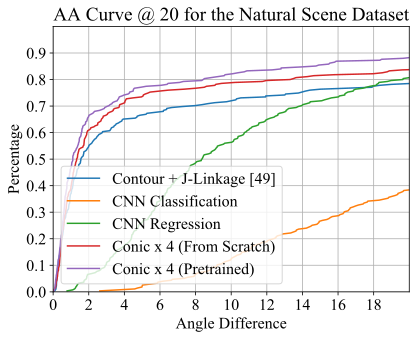
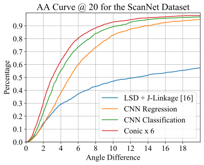

# NeurVPS: Neural Vanishing Point Scanning via Conic Convolution

This repository contains the official PyTorch implementation of the paper:  *[Yichao Zhou](https://yichaozhou.com), [Haozhi Qi](http://haozhi.io), [Jingwei Huang](http://stanford.edu/~jingweih/), [Yi Ma](https://people.eecs.berkeley.edu/~yima/). ["NeurVPS: Neural Vanishing Point Scanning via Conic Convolution"](https://arXiv/Link)*.

## Introduction

NeurVPS is an end-to-end trainable deep network with *geometry-inspired* convolutional operators for detecting vanishing points in images.  With the power of data-driven approaches and geometrical priors, NeurVPS is able to outperform the previous state-of-the-art vanishing point detection methods such as [LSD/J-Linkage](https://github.com/simbaforrest/vpdetection) and [Contour (TMM17)](https://github.com/heiheiknight/vpdet_tmm17).

## Main Results

### Qualitative Measures

| [SceneCity Urban 3D (SU3)](https://arxiv.org/abs/1905.07482) | [Natural Scene (TMM17)](https://faculty.ist.psu.edu/zzhou/projects/vpdetection/) | [ScanNet](http://www.scan-net.org/) |
| ------------------------------------------------------------ | ------------------------------------------------------------ | ----------------------------------- |
|                                        |                                      |         |

### Quantitative Measures

| [SceneCity Urban 3D (SU3)](https://arxiv.org/abs/1905.07482) | [Natural Scene (TMM17)](https://faculty.ist.psu.edu/zzhou/projects/vpdetection/) | [ScanNet](http://www.scan-net.org/)    |
| ------------------------------------------------------------ | ------------------------------------------------------------ | -------------------------------------- |
|                                  |                            |  |

Here, the x-axis represents the angular error of the detected vanishing points and the y-axis represents the percentage of the results whose error is less than that. Our conic convolutional networks outperform all the baseline methods and previous state-of-the-art vanishing point detection approaches, while naive CNN implementations might underperform those traidional methods, espeically in the high-accuracy regions.

### Code Structure

Below is a quick overview of the function of each file.

```bash
########################### Data ###########################
data/                           # default folder for placing the data
    su3/                        # folder for SU3 dataset
    tmm17/                      # folder for TMM17 dataset
    scannet-vp/                 # folder for ScanNet dataset
logs/                           # default folder for storing the output during training
########################### Code ###########################
config/                         # neural network hyper-parameters and configurations
    su3.yaml                    # default parameters for SU3 dataset
    tmm17.yaml                  # default parameters for TMM17 dataset
    scannet.yaml                # default parameters for scannet dataset
dataset/                        # all scripts related to data generation
    su3.py                      # script for pre-processing the SU3 dataset to npz
misc/                           # misc scripts that are not important
    find-radius.py              # script for generating figure grids
neurvps/                        # neurvps module so you can "import neurvps" in other scripts
    models/                     # neural network architectures
        cpp/                    # CUDA kernel for deformable convolution
        deformable.py           # python wrapper for deformable convolution layers
        conic.py                # conic convolution layers
        hourglass_pose.py       # backbone network
        vanishing_net.py        # main network
    datasets.py                 # reading the training data
    trainer.py                  # trainer
    config.py                   # global variables for configuration
    utils.py                    # misc functions
train.py                        # script for training the neural network
eval.py                         # script for evaluating a dataset from a checkpoint
```

## Reproducing Results

### Installation

For the ease of reproducibility, you are suggested to install [miniconda](https://docs.conda.io/en/latest/miniconda.html) (or [anaconda](https://www.anaconda.com/distribution/) if you prefer) before following executing the following commands. 

```bash
git clone https://github.com/zhou13/neurvps
cd neurvps
conda create -y -n neurvps
source activate neurvps
# Replace cudatoolkit=10.1 with your CUDA version: https://pytorch.org/get-started/
conda install -y pytorch cudatoolkit=10.1 -c pytorch
conda install -y tensorboardx -c conda-forge
conda install -y pyyaml docopt matplotlib scikit-image opencv tqdm
mkdir data logs
```

### Downloading the Processed Datasets
Make sure `curl` is installed on your system and execute
```bash
cd data
../misc/gdrive-download.sh 1yRwLv28ozRvjsf9wGwAqzya1xFZ5wYET su3.tar.xz
../misc/gdrive-download.sh 1rpQNbZQEUff2j2rxr3mBl6xohGFl6sLv tmm17.tar.xz
../misc/gdrive-download.sh 1y_O9PxZhJ_Ml297FgoWMBLvjC1BvTs9A scannet.tar.xz
tar xf su3.tar.xz
tar xf tmm17.tar.xz
tar xf scannet.tar.xz
rm *.tar.xz
cd ..
```

If `gdrive-download.sh` does not work for you, you can download the pre-processed datasets
manually from our [Google
Drive](https://drive.google.com/drive/folders/1xBcHj584zGxhMboZNJHWlAe_XIbHfC34) and proceed
accordingly.


### Training
Execute the following commands to train the neural networks from scratch on 2 GPUs (GPU 0 and GPU 1, specified by `-d 0,1`) with the default parameters:
```bash
python ./train.py -d 0,1 --identifier su3 config/su3.yaml
python ./train.py -d 0,1 --identifier tmm17 config/tmm17.yaml
python ./train.py -d 0,1 --identifier scannet config/scannet.yaml
```

The checkpoints and logs will be written to `logs/` accordingly. It has been reported that it is possible to achieve  higher performance with 4-GPU training, though the training process is more volatile.

### Pre-trained Models

You can download our reference pre-trained models from [Google
Drive](https://drive.google.com/drive/folders/1srniSE2JD6ptAwc_QRnpl7uQnB5jLNIZ).  Those pretrained
models should be able to reproduce the numbers in our paper.

### Evaluation

Execute the following commands to compute and plot the angular accuracy (AA) curves with trained network checkpoints:

```bash
python eval.py -d 0 logs/YOUR_LOG/config.yaml logs/YOUR_LOG/checkpoint_best.pth.tar
```

### Citing NeurVPS

If you find NeurVPS useful in your research, please consider citing:

```
@inproceedings{zhou2019end,
 author={Zhou, Yichao and Qi, Haozhi and Huang, Jingwei and Ma, Yi},
 title={NeurVPS: Neural Vanishing Point Scanning via Conic Convolution},
 booktitle={NeurIPS},
 year={2019}
}
```
